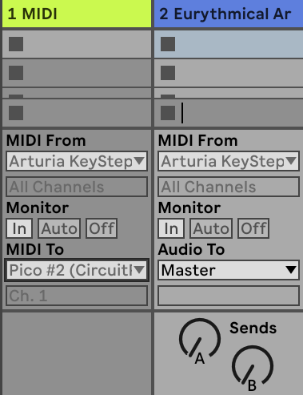

# Lasy Oliwskie

Physical LED visuals for a music track inspired by the Oliwa Woods.

This fun project was built and recorded during the
[MusicJam 2022](https://musicjam.pl/) musical hackathon. The theme of the
hackathon was (un)usual sounds, particularly related to Gdańsk.

Our team consisted of:

- [tgbdc7](https://github.com/tgbdc7) and myself doing the hardware/software
  part,
- [Alek](https://github.com/gruszal) playing the solo,
- [Ralph](https://soundcloud.com/ralphgpl) doing field recording in the Oliwa
  Woods, composing music, and arranging it.

During the 8 hours of the hackathon we worked on a project titled
"Lasy Oliwskie" ("Oliwa Woods").

We used Ableton Live with MIDI out to Raspberry Pi Picos, some LED rings,
a LED matrix, two grocery bags as diffusers, and some paper cups.

The end result was a music track, an illuminated tree reacting to bass guitar,
and illuminated "moss" reacting to the beat.

You can check the results here: https://youtu.be/wjZ24oi5ai4?t=96

[](https://youtu.be/wjZ24oi5ai4?t=96)

The code is based on
[the excellent gist](https://gist.github.com/todbot/ec5c6ed9101fe25bc741e22599f30361)
created by [Tod Kurt](https://github.com/todbot), here relicensed to
[MIT license](https://opensource.org/licenses/MIT) by his permission.

## Bill of Materials (BoM)

- 2 Raspberry Pi Picos (or other similar microcontrollers compatible with
  CircuitPython) (approx. cost: 20PLN, 5EUR, 5USD)
- A 16x16 WS2812B LED matrix (approx cost: 70PLN, 30EUR, 30USD)
- LED rings of decreasing diameter, we used: 45LED, 35LED, 24LED, 16LED, 8LED
  (approx cost: 140PLN, 30EUR, 30USD).
- something to base your LED rings tree on, we used a paper cup, and cardboard
  together with hot glue
- for better effects: some nice diffuser, we used cloth grocery bags that were
  available at the spot
- some wire or better yet JST 3-pin connectors

Total cost: around 250-300PLN, 70-80EUR, 70-80USD.

## Assembling the Hardware

Solder the wires (or JST connectors) to the Pi Picos. The red wire should go to
VBUS, white one to GND, and green one to GP28 (pins 40, 38, 34 respectively).

For the moss, just place the LED matrix on a surface and connect it to one of
the Picos. Optionally add diffuser.

The tree is a little bit more complicated, but the general idea is to have the
LED rings connected starting from the biggest one to the smallest one. We used
a paper cup as a base for the 35LED ring, pulled some cardboard through the
center, and then attached the rest.

Flash the Raspberry Pi Picos with [CircuitPython](https://circuitpython.org/board/raspberry_pi_pico/).

## Programming the Raspberry Pi Pico

The code for the tree is in the `drzewo` subdirectory.

The code for the moss is in the `mech` subdirectory.

Drzewo and mech are Polish for tree and moss.

The code is written in CircuitPython and uses some additional libraries. The
easiest way to install them is with [circup](https://github.com/adafruit/circup)

For the moss controller run:

```
circup install -r mech/requirements.txt
```

For the tree controller run:

```
circup install -r tree/requirements.txt
```

After that, install [smolmidi](https://github.com/wntrblm/Winterbloom_SmolMIDI)
by copying it to the `lib` directory on your Picos.

Finally, copy the `code.py` from both subdirectories onto the respective Picos.

## Installing Ableton

This project requires you to have Ableton installed on your machine. Free
90-day trial is available that lets you play and experiment, but you won't be
able to save any changes to your project.

On MacOS, you can get it with `brew install ableton-live-standard`.

In Ableton Live (Standard or Suite, Lite does not have MIDI out),
select Live->Preferences on Mac (Options->Preferences on Windows).

Find the MIDI tab and make sure Pi Pico has a checkmark next to the output
device.



## Exploring the Project

1. [Download the Ableton project](https://doomhammer.fra1.digitaloceanspaces.com/Music_Jam.alp)
1. Import the Ableton Project (double clicking works fine)
1. Open it
1. Press play
1. Enjoy

The tree should react to the guitar solo, the moss to the beat. If you get
different effects, you probably need to swap the devices connected as outputs
to the Guitar MIDI and Drums MIDI tracks.
